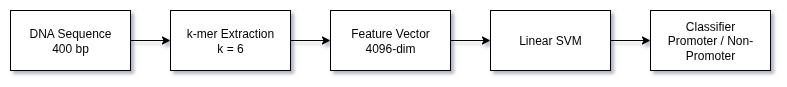
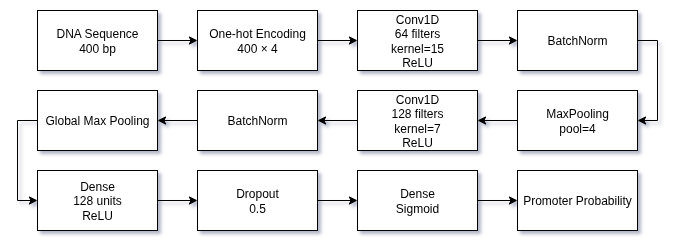
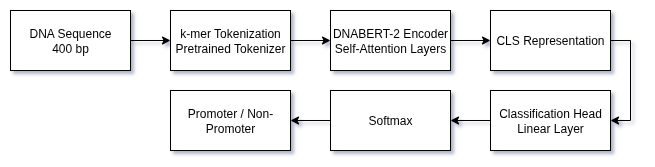
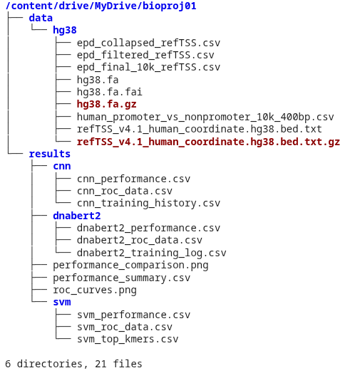
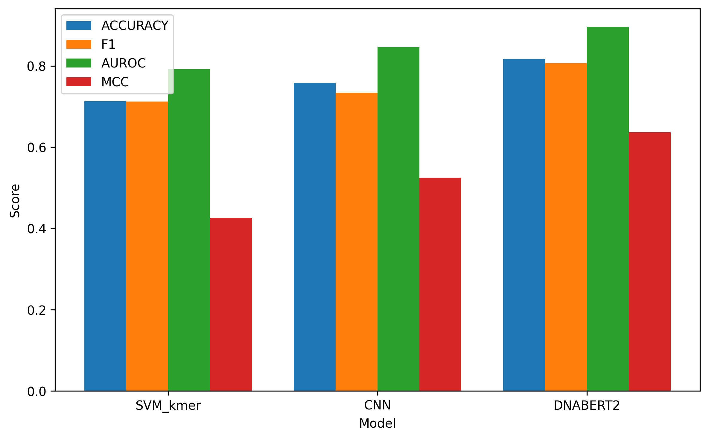
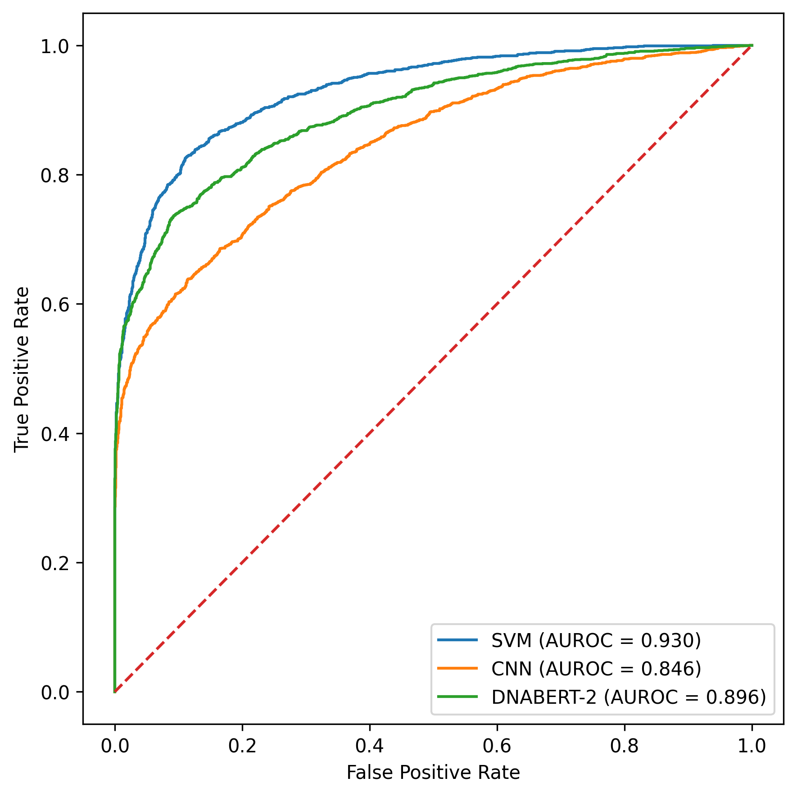

# From k-mers to Transformers: A Systematic Benchmark of Model Architectures for Promoter Prediction

**Advanced Bioinformatics Term Project**

This repository contains the code and resources for benchmarking different machine learning architectures for human promoter prediction using the hg38 reference genome.

## Overview

The project systematically compares three different modeling approaches:

### 1. SVM (Support Vector Machine)
A baseline model using k-mer features.



### 2. CNN (Convolutional Neural Network)
A deep learning model learning local sequence motifs.



### 3. DNABERT2 (Transformer)
A state-of-the-art foundation model for DNA sequences.



## Google Colab Setup & Instructions

The notebooks are designed to run on Google Colab. Follow these steps to set up your environment:

### 1. Folder Structure
Create the following directory structure in your Google Drive:

```
My Drive/
└── bioproj01/
    └── data/
        └── hg38/
            ├── refTSS_v4.1_human_coordinate.hg38.bed.txt
            └── hg38.fa
```



### 2. Data Preparation
You need to download the source data and place it in the `data/hg38` folder created above.

*   **Promoter Annotation (RefTSS)**:
    *   **Source**: [RefTSS Human Data](http://reftss.clst.riken.jp/datafiles/current/human/)
    *   **File**: `refTSS_v4.1_human_coordinate.hg38.bed.txt`
*   **Reference Genome (hg38)**:
    *   **Source**: [UCSC GoldenPath](https://hgdownload.soe.ucsc.edu/goldenPath/hg38/bigZips/hg38.fa.gz)
    *   **File**: `hg38.fa.gz`
    *   **Important**: You must unzip the genome file before uploading.
        ```bash
        gunzip hg38.fa.gz
        # Output will be hg38.fa, upload this file.
        ```

### 3. Notebook Execution
Run the notebooks in the following order. Ensure you select the appropriate hardware accelerator as noted.

| Order | Notebook | Task | Hardware | Description |
| :--- | :--- | :--- | :--- | :--- |
| 1 | `hg38_data.ipynb` | Data Preprocessing | CPU | Parses annotations, extracts sequences, performs negative sampling, and saves the dataset (`human_promoter_vs_nonpromoter_10k_400bp.csv`). |
| 2 | `hg38_svm.ipynb` | SVM Baseline | CPU | Extracts k-mer features and trains an SVM classifier. |
| 3 | `hg38_cnn.ipynb` | CNN Model | T4 or A100 GPU | Trains a 1D Convolutional Neural Network. (A100 recommended, but runs on T4). |
| 4 | `hg38_transformer.ipynb` | DNABERT2 Model | **A100 GPU** | Fine-tunes the DNABERT2 transformer model. **Requires A100** due to memory constraints. |

**Note**: The DNABERT2 notebook will not run on the standard T4 GPU available in the free tier of Colab due to memory requirements. You will need Colab Pro / Pro+ with an A100/A100 (40GB) instance.

## Output Files
The `hg38_data.ipynb` notebook will generate the following intermediate files in your Drive:
*   `epd_filtered_refTSS.csv`
*   `epd_collapsed_refTSS.csv`
*   `epd_final_10k_refTSS.csv`
*   `human_promoter_vs_nonpromoter_10k_400bp.csv` (Used by all model notebooks)

## Performance Benchmark

The following table summarizes the performance of the three models on the test set:

| Model | Accuracy | F1 Score | AUROC | MCC |
| :--- | :--- | :--- | :--- | :--- |
| **SVM_kmer** | 0.713 | 0.713 | 0.792 | 0.425 |
| **CNN** | 0.758 | 0.733 | 0.846 | 0.525 |
| **DNABERT2** | **0.817** | **0.806** | **0.896** | **0.637** |

### Visual Comparisons

#### Performance Metrics Comparison


#### ROC Curves


## License
MIT License
